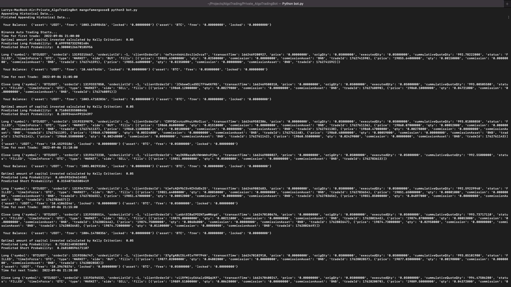

# Algorithmic-Trading-Bot

### Description

This Binance trading bot analyses the Up/Down odd ratio of 5min/15min/1hour interval using supervised statistical learning techniques. Logistic regression is used in this trading bot. 8 qualitative and 2 quantitative variables are selected as predictors with a view to predict the probaility that whether the price of BTC/USDT at time t+1 will rise given predictors as time t. You may check the jupyter notebook for implementation details. For details about Logistic regression, click [here](https://en.wikipedia.org/wiki/Logistic_regression). Kelly's Criterion is used to select the optimal capital for investment. Due to compilance problems, short position is not available. BTC/USDT spot trading pair is selected due to Binance's 0% trading fee. A 80% correct classification rate is observed.

### Trading Logic

The bot initalizes historical data from 1 Jul, 2020 onwards and a logistic regression model is fitted. After loading, it creates a market order at your specified interval. If the predicted long probability > 0.5, a long order would be executed via market order at time t. The bot then closes the long position at time t+1. Percentage of investment is selected using Kelly's Criterion.

> Example

1. Goose selects interval = 5 mins. The bot finishes loading at 20:07.
2. During 20:07 and 20:10, nothing will happen.
3. At 20:10, the predicted long probability is 0.52. The bot longs BTC.
4. At 20:15, the bot closes the long position. The following is just a loop in 3 and 4 with time step = 5 mins

### READ BEFORE USE

1. Check the isTestNet variable in config.py = False. Otherwise you will be using REAL money.

### Binance Guide

For Testnet, please follow this [guide](https://www.binance.com/en/support/faq/ab78f9a1b8824cf0a106b4229c76496d)

For Mainnet, please follow this [guide](https://www.binance.com/en/support/faq/360002502072)

If you do not have a binance account, please consider registering with the link below.
https://www.binance.com/en/activity/referral-entry/CPA?fromActivityPage=true&ref=CPA_00SB23W192

### Setup Guide
---
Must have Python 3.9+ Installed.
Libraries Required:
- numpy
- pandas
- sklearn
- [talib](https://github.com/mrjbq7/ta-lib)
- [python-binance](https://github.com/sammchardy/python-binance)

```
#If you're using macOS

git clone https://github.com/mangofarmergoose/Algorithmic-Trading-Bot
cd Algorithmic-Trading-Bot

pip3 install numpy
pip3 install pandas
pip3 install sklearn

python3 bot.py #To run the bot
```
For talib and python-binance, please follow the original documentations linked above.
Installing these libraries should be trivial regardless of platforms.

---


### Configuration
---
Open config.py.
- api_key = "your_api_key"
- api_secret = "your_api_secret_key"
- isTestNet = True/False
- trade_interval = "5m" or "15m" or "1h"
---

### Trading Panel
> User interface of the trading panel



Note: Depending on which interval you select, the time of "Appending Historical Data" might differ. Give the process some time as the datasets are huge.

### Donation
---

Consider donating to support my development!


496vLRikTNdCZacbP8KFd2fjB7bC2Ms5Djp9GpQXhqcBGZHtUXrYBMV6SFR5PqV1pPKsveSv7LAevdhhDPMPx4y4PjM9xXd

---
